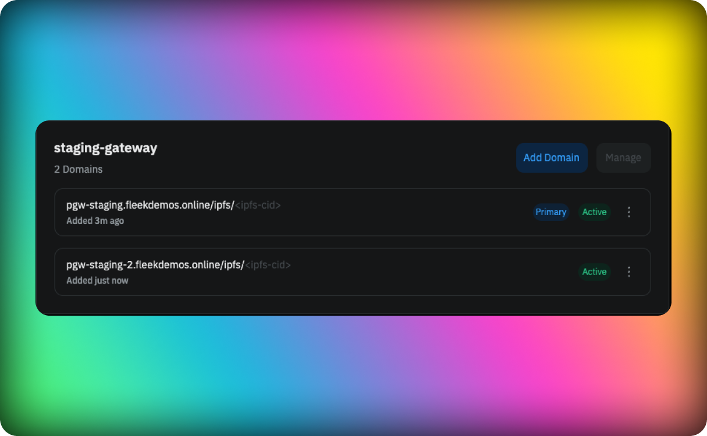

### Introduction

In this section we will dive deeper into the IPFS private gateways services and how to use them to serve your content to your users. We will go through the following topics:

- What is a private gateway?
- Creating a private gateway
- Deleting a private gateway

### What is a private gateway?

A private gateway is a service that allows you to serve your content to your users through a custom domain. This means that you can serve your content through a domain like `https://mydomain.com` instead of `https://ipfs.io/ipfs/<hash>`.

They are private because this gateway only allow the files pinned in you account to be served. By allowing you to set up a custom domain it gives you an extra branding layer to your content.

### Creating a private gateway

To create a private gateway you will need to have a Fleek project and a custom domain. Currently we are making mandatory that each private gateway has at least one custom domain associated with it to avoid abuse.

To set up the gateway you have to go to the project settings and click on the `Gateways` tab. In this tab you will see a list of all the gateways you have created for this project. To create a new gateway you need to add a name for it and click on the `Add Gateway` button. Once the gateways is created a modal will appear to add your first custom domain on top of it.

You need to add the domain and in similar fashion to how its added to a site in [Custom domains](/docs/Domains/custom-domains) section you will need to configure the DNS provider to point to the gateway. Once you have configured the DNS provider you can click on the `Ok, I have added it` button and and we will run the verification to make sure its setted up correctly.

Once the verification is completed you will see the status of the gateway change to `Active` and you will be able to use it to serve your content. You can access the content on your gateway via the domain like this `my-gateway-url/ipfs/<cid>` and `my-gateway-url/ipns/<cid>`

You can set up more than one domain per gateway. To do this you can click on the three dots icon in the gateway row and select the `Add Domain` option. This will open a modal where you can add a new domain to the gateway.

### Priamry Domains

Whe you have correctly seted up your first domain it will be marked with the tag of `Primary`. The `Primary` domain is the main domain for a storage and it will be used inside of the platform for every action that is related to files as source of truth. For example, when you store a file, the domain that will be used in the `view file` button will be the `Primary` domain.

#### Changing a primary domain

At any point, as long as you have another `Active` domain seted up for the Private Gateway you can change the `Primary` domain. To do this, you need to click on the three dots icon in the custom domains table and select the `Make Primary` option. This will change the `Primary` domain to the one you selected. It is important to remind you that you cannot set a domain as `Primary` if it is not `Active`, meaning that we have verified that the domain is correctly configured in your DNS provider.

### Deleting a custom domain

To delete a custom domain, you can on the three dots icon in the custom domains table and select the delete option. This will remove the custom domain from your Private Gateway and will no longer serving the content of your storage. In the case that you are deleting a `primary` domain, as part of the delete process you and only if you have another `active` domains, you will have to select a new `primary` domain.

:::info

If you remove all the custom domains from all the private gateways in your project, the content of the storage will still be available through the public IPFS gateways.

:::

### Deleting a private gateway

To delete a private gateway, first you need to remove all the domains associated to it and then click on the manage button in the gateway row and select the option to delete the gateway. This will remove the gateway and all the content associated to it.

:::info

When you delete a gateway and the domains associates is an async process so the content might be reflected by your domain for a few minutes. We always recomend that you remove the DNS configuration for the domain to avoid any issues.

:::